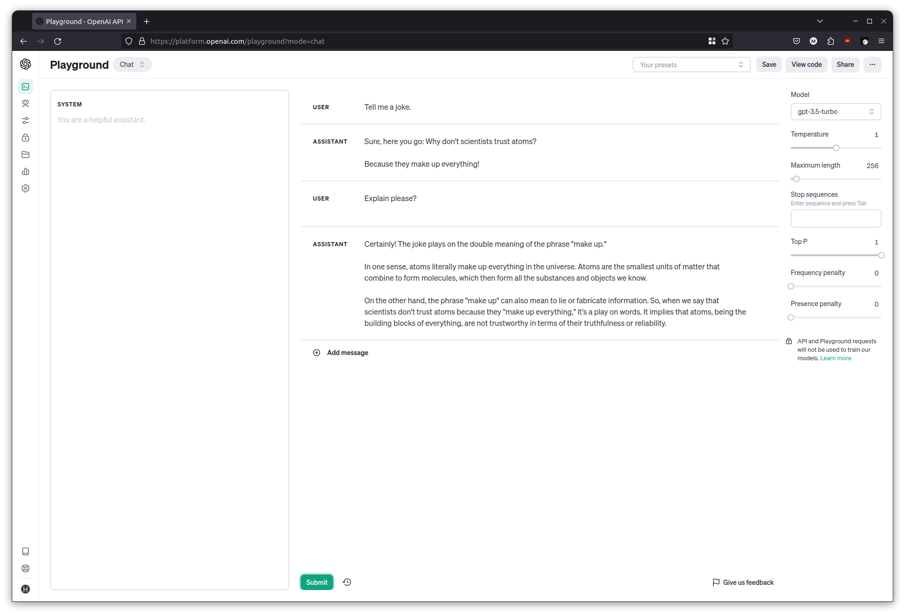
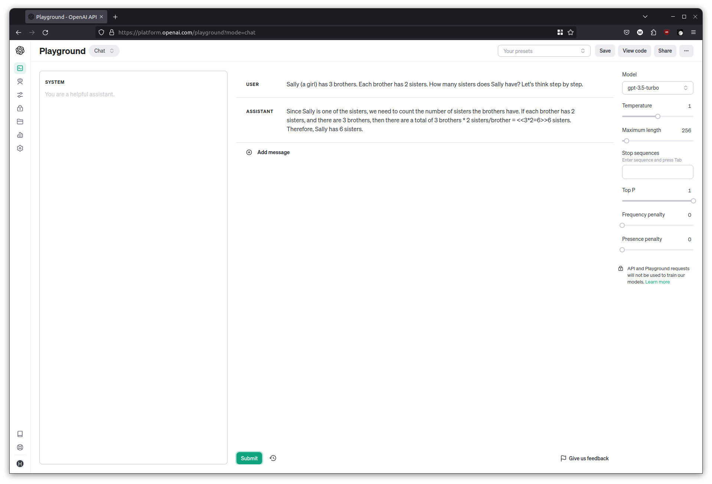
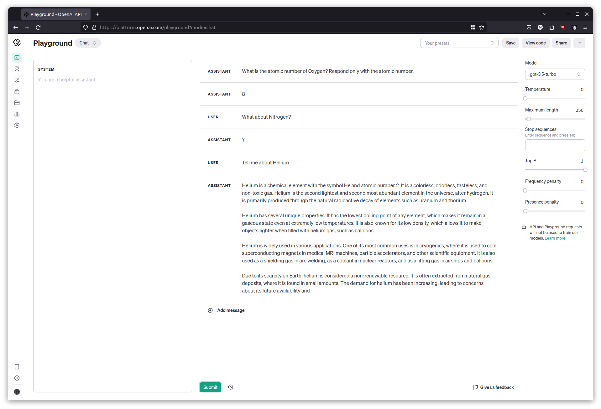
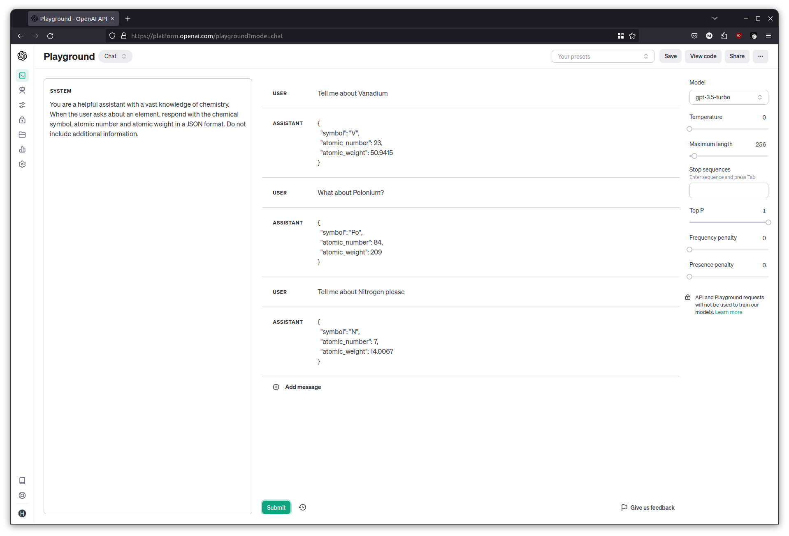

In this post I will go over an approach to getting developers familiar with LLMs, and how to write code against them. It is not meant to be in depth in any way, nor will it cover the inner workings of LLMs or how to make your own. The aim is to simply get developers comfortable interacting with LLMs. As with any field, are nuances in the concepts involved, and those will be conveniently hand-waved away. 

For this tutorial you will need access to a commercial off-the-shelf LLM service, such as [OpenAI Playground](https://platform.openai.com/playground), [Azure OpenAI](https://oai.azure.com/portal/), or [Amazon Bedrock](https://us-east-1.console.aws.amazon.com/bedrock/home?region=us-east-1#/text-playground/amazon.titan-text-express-v1); in my examples I will be referencing OpenAI's playground but the others will have similar functionality to follow along. You'll also need a Python notebook, which can be a service like [Google Colab](https://colab.research.google.com), [Paperspace Gradient](https://www.paperspace.com/), or [locally in VSCode](https://code.visualstudio.com/docs/datascience/jupyter-notebooks). 

I'll first start with some direct LLM interactions as it helps to have a base understanding of what's happening behind the scenes, and then build up to the actual programmatic interaction in Python. 


## Clarify some terms

It helps to be familiar with some of the words that are used in this area. Some are pure marketing, and some have specific meanings. 

**AI** is supposed to be the branch of computer science trying to get machines to do intelligent things. It has now been coopted by mainstream media and is now employed as a marketing buzzword. It is used to describe any sufficiently advanced technology that wows people, which they don't understand. As an example, text to speech conversion (dictation) was referred to as AI when it first came out decades ago, but is now a pedestrian aspect of many application interfaces.  

**Machine Learning** is a subset of AI (the field) that focuses on the development of algorithms and models to enable the performance of specific tasks, like predicting the weather, or identifying a dog breed from a photograph. 

**Large Language Models**, or LLMs, are a specific type of model that have been trained on a large amount of text data, to understand and generate human like language as an output. LLMs have been gaining a lot of media and business attention in the past few years. Well known LLMs are GPT by OpenAI, Claude by Anthropic, and LLaMa by Meta. 

**Image generation models**, are also gaining attention, and these can generate an image based on a text description, in various styles and degrees of realism. The most well known systems here are Dall-E, MidJourney and Stable Diffusion. 

Similarly there are also models for music generation, video generation, code generation, and speech. The collective term for these content creation models is **Generative AI**, or shortened to GenAI to appear in-the-know in circles of acquaintances who don't know the difference and don't care anyway. 

Of the many types, LLMs get a lot of attention from businesses, research, and hobbyists, because they are very easy to work with. It's simply text input and output, and there are a lot of techniques emerging to optimize working with them. 


## Text completion and temperature

In your LLM playground, switch to the completions tab. Completions is very close to the raw interface of an LLM, you just provide it with some text and a few additional parameters. 

Give it any sentence fragment to begin with, like

    Once upon a time, 

and let it generate text. It might appear a little nonsensical, but the LLM simply produces what it thinks should come next after your fragment. 

Try a few more fragments, which can be quite revealing. 

    The following is a C# function to reverse a string:

See how it produces the C# function asked for, but carries on producing output (such as how to use the function, or the same function in other languages), until it reaches the maximum length. The takeaway here is that an LLM is not a chatbot out of the box. You can think of an LLM as a very good autocomplete tool, for some given input text it has a decent idea of what should come next. It's up to us to shape the LLM to get it to produce *useful* output. 


Try adjusting the temperature slider now, and see how it affects the output.  Try the following prompt at temperature = 0 and then at temperature = 1. 

    The sky is blue, and 
 
**Temperature** influences the randomness of the model's output; at higher temperatures the generated text is more creative, and at lower temperatures it's more focused. When programming against LLMs, using low temperatures is better if you need a more deterministic, repeatable output.  







### Tokens and context

**Tokens** are mentioned frequently in LLM interfaces, conversations, as well as pricing.  

Tokens are the units of text that the models understand. They are sometimes full words, and sometimes parts of words or punctuation. The best way to see for yourself is to try the [OpenAI Tokenizer](https://platform.openai.com/tokenizer) and see the example. 


Notice that some words get split up, some characters that often appear together are grouped up, and some punctuation marks get their own token. There is no exact conversion between tokens and words but the most common idea is to consider on average 4 to 5 characters as be a token.  

LLMs come with a maximum **token context** or context window. Think of it as the number of tokens that the LLM can deal with while still (kind of) being effective at its predictions. The token context includes your input prompt, the output from the model, and any other previous tokens you may have included. LLMs come with a limited token context depending on the model. 


Some well known LLMs and their limits: 

* GPT 3.5: 16k tokens
* GPT 4: 32k tokens
* GPT 4 Turbo: 128k tokens
* Claude v2: 100k tokens
* LLaMa2: 4k tokens

It's tempting to think that the 100k+ LLMs are the best for being able to handle so much at once, but it's not a numbers game. In practice, LLMs start to lose attention when it has to deal with too much input, it 'forgets' what the important parts of your initial input were, and results in poor output. 

## Chatbots are just completion with stop sequences

While still in the Text Completion playground, switch to another model such as `davinci-002`. Since it isn't made for Q&A type tasks, it is better for illustrating the next concept. 

Begin with a conversational type input like this:

```
Alice: Hi how are you?
Assistant:  
```

and hit generate. In many cases you will see the text completion produces an output for the Assistant, but carries on the conversation for Alice as well. This is the same principle as before, essentially, producing what a chat transcript could look like between these two characters. 

Now add a **Stop sequence** to the parameters in the completion interface. Add `Alice:` then repeat the above exercise. After each response it will stop instead of producing the next `Alice:`. You can carry on the conversation by having Alice ask another question, and then end each new input with `Assistant:`, to carry on the conversation.  

```
Alice: Is everything alright with my account?
Assistant: 
```






There's your rudiemntary chatbot. Each time you hit generate, you are sending the previous conversations (the history) as well as your latest input. The model produces an output until it hits the stop sequence.



OpenAI's Playground as well as Amazon Bedrock's interface make this exercise a bit difficult by seemingly forcing the stop sequence tokens rather than letting the model continue producing output. 



## Using a chat interface

Switch to the Chat playground. From what you've learned so far, it should now be a little more obvious how the chat based interface is working behind the scenes. The chat interface is the one most people will be familiar with, through the well known examples of ChatGPT and Claude. It is also the interface that most LLM programming is written for as it is tuned for Q&A type work. 

### Chat with history

Try a simple exercise. Ask it to tell you a joke and then ask for an explanation. 

```
Tell me a joke
```

```
Explain please?
```

The chat interface retains history, so the previous question and answer are included in the input when you ask for the explanation. This history retaining feature is a useful and natural part of chatbots, but do keep in mind that it uses up some of your context window. 



### Summarizing news

A common task with LLMs is to ask it to summarize something. Grab a news article from anywhere, and copy its contents. Ask the chatbot to summarize the news article. The models are pretty good at sifting through irrelevant bits in between too. 

```
Summarize the following news article:

<paste your news article here>
```


### Answering questions

You can also ask the LLM to answer a question for a given text. Grab the contents of [this article about an asteroid](https://www.universetoday.com/164299/an-asteroid-will-occult-betelgeuse-on-december-12th/), and ask it a question about where the best locations would be to view it. 

```
Given the following news article, answer the question that follows. 

Article: <paste the news article here>

Question: What are the best locations to see the asteroid?
```


## Context and reasoning with a chatbot

Remember that chatbots work with a context, and based on the additional hints and information you give it, it can generate text to fit that scenario. 

Try the following input with the chat interface. 

```
Complete the sentence. She saw the bat ___
```

The output I got was alluding to the mammal: `flying through the night sky.`

Clear the chat then try this. 

```
Complete the sentence. She went to the game and saw the bat  ___
```

This gave me a completion about a bat of the wooden variety: `She went to the game and saw the bat hitting home runs.`

The ability to understand an input and respond, with some given context, makes LLMs appear as though they can be used for reasoning. This is considered an emergent property of its language skills, and at times, it is able to do a decent job. 

You can ask the chat interface to emulate reasoning by adding a "Let's think step by step" at the end of a question. 

```
Who is regarded as the greatest physicist of all time, and what is the square root of their year or birth? Let's think step by step.
``` 


This doesn't always work well though. With the following example from [LLMBenchmarks](https://benchmarks.llmonitor.com/),

```
Sally (a girl) has 3 brothers. Each brother has 2 sisters. How many sisters does Sally have? Let's think step by step.
```

I was reliably informed that Sally had six sisters. 

As amusing as the answer is, it's a contrived example of the dangers that LLMs come with. It has produced a reasonable looking passage of text that *seems* to answer the question, but it can be wrong, and it's really on us to verify it. 




## Shaping the response

So far I've only been showing basic interaction with LLMs. For programmatic interactions, it's important to get the LLM to produce an output that can be worked with in code. Most commonly, you would ask it to produce a single word, or even JSON or XML. 

Let's make the chatbot help with chemistry related questions. We want it to tell us the atomic number of a given element that the user mentions. 

Clear the chat and set the temperature to 0. Start by asking it to produce only the atomic number, and then follow up with some more element names. 

```
What is the atomic number of Oxygen? Respond only with the atomic number.
```

```
What about Nitrogen?
```

```
Tell me about Helium
```

The LLM can get distracted quite easily and go back to its chatty mode, which isn't great for programmatic interaction. 

### System Messages

A good way to deal with this is to give it a 'role' to play, known as the **system message**. This message gets added right at the beginning of the input to the LLM, which sets the context for the rest of the conversation. 

Clear the chat messages, then in the System prompt area, add the following:

```
You are a helpful assistant with a vast knowledge of chemistry. When the user asks about an element, respond with only the atomic number of the element. Do not include additional information.
```

Try the same questions as before, and the responses should be more consistent this time.  






### Giving the LLM examples to learn from

This time, we'd like the chat interface to produce JSON output so that it's easier to work with in our code. You can start by modifying the system message and simply asking for some JSON. 

Clear the chat, then in the System prompt area:

```
You are a helpful assistant with a vast knowledge of chemistry. When the user asks about an element, respond with the chemical symbol, atomic number and atomic weight in a JSON format. Do not include additional information.
```

Try asking about some elements and it should respond with some JSON, I got an output like `{"symbol": "V", "atomic_number": 23,  "atomic_weight": 50.9415 }`

Although the LLM made up the JSON key names, there's no guarantee it will always use those key names. We want to control the JSON key names and have the LLM follow our schema. 

This is where examples come in. In the System prompt area, it's possible to provide a few examples to get the LLM going, and then any subsequent answers it produces should follow those examples. This technique is known as **Few Shot Prompting**. 

Clear the chat, then in the System prompt area:

```
You are a helpful assistant with a vast knowledge of chemistry. When the user asks about an element, respond with the chemical symbol, atomic number and atomic weight in a JSON format. Do not include additional information.

Examples:

User: Tell me about Helium. 
Assistant: {"sym": "He", "num": 2, "wgt": 4.0026}

User: What about Nitrogen?
Assistant: {"sym": "N", "num": 7, "wgt": 14.0067}
```

Try your questions once more and observe as the JSON keys match your examples. 







## Programming with Langchain

